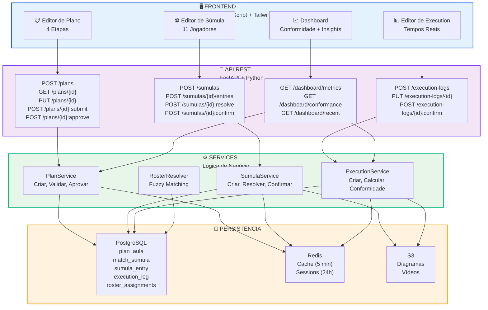
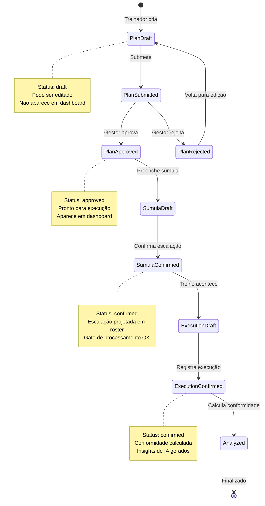
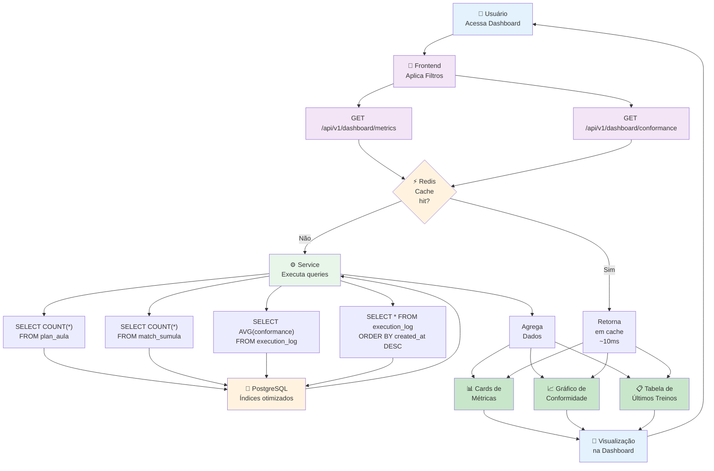
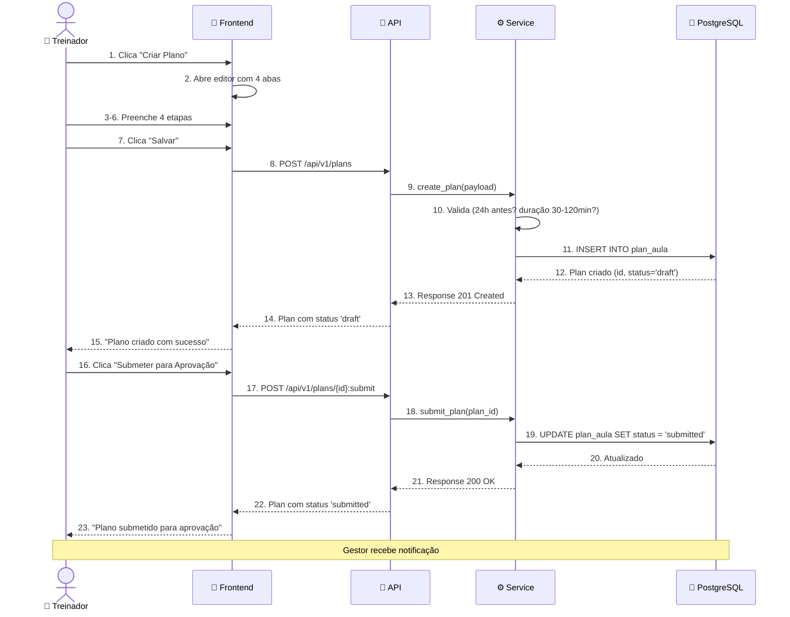
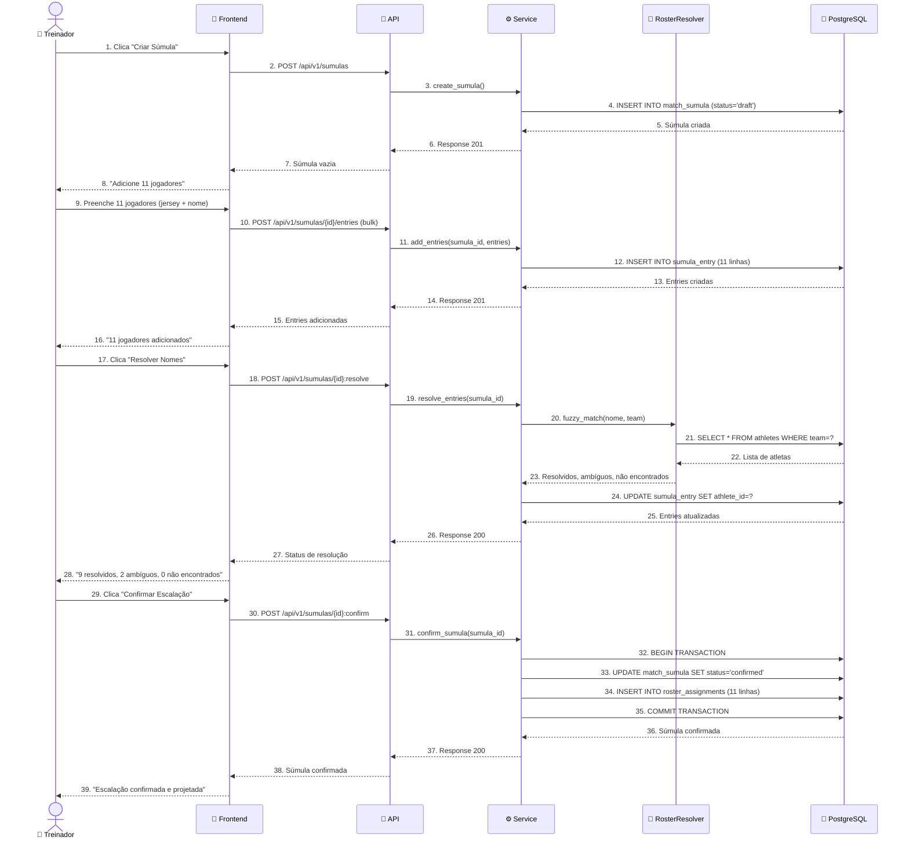
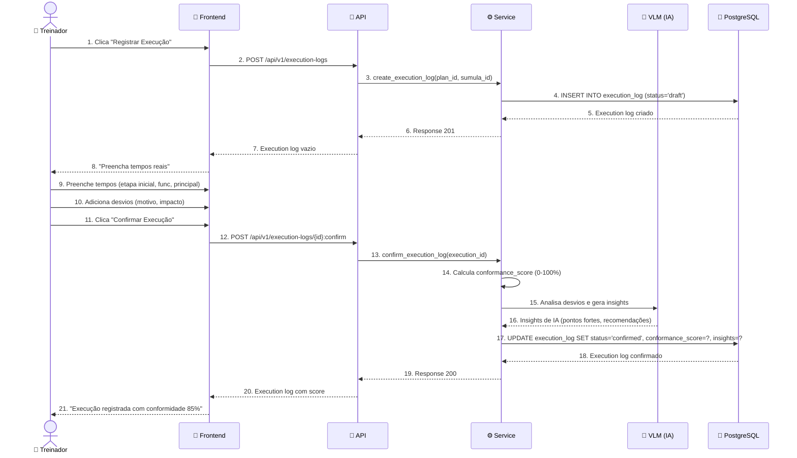
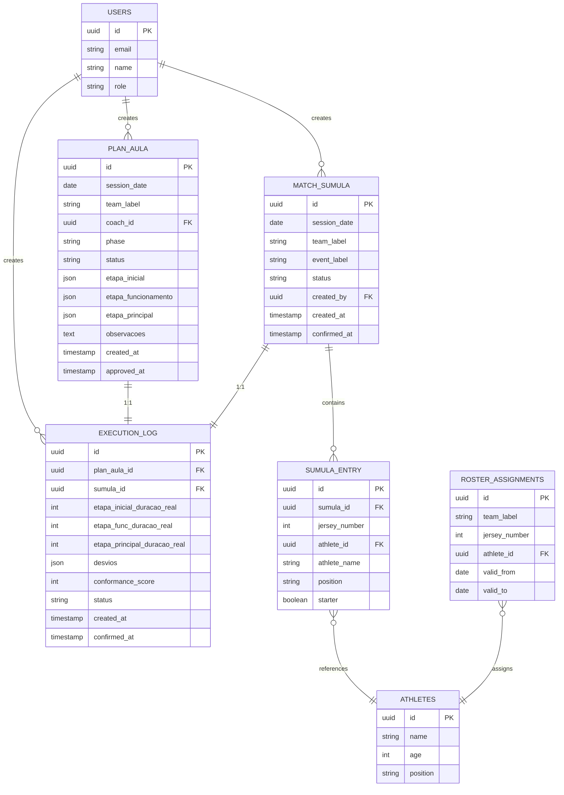
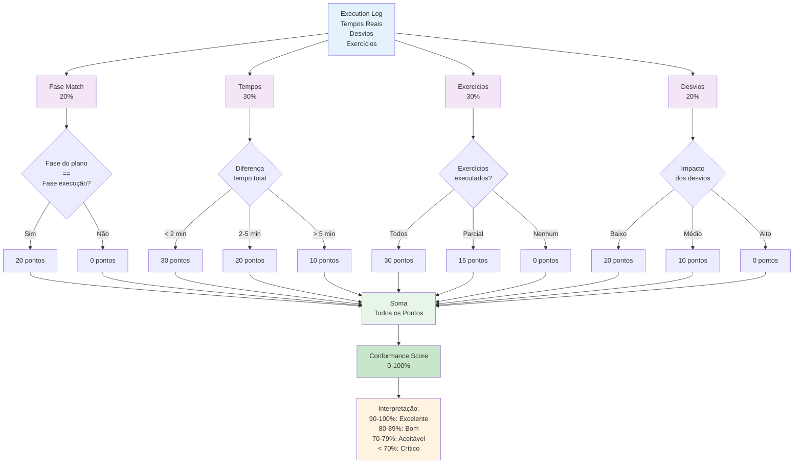

# 📊 DIAGRAMAS MERMAID - PARA CLAUDE CODE VISUALIZAR
## Dashboard de Gestão de Treinos - BIG SOCCER by iSCOUT

**Use estes diagramas como referência visual enquanto cria os wireframes**

---

## DIAGRAMA 1: ARQUITETURA DO SISTEMA

---

## DIAGRAMA 2: FLUXO DE 4 FASES

```mermaid
graph LR
    subgraph Phase1["📋 FASE 1<br/>PLANEJAMENTO<br/>24h antes"]
        P1A["Treinador<br/>Cria Plano"]
        P1B["Define 4<br/>Etapas"]
        P1C["Submete para<br/>Aprovação"]
        P1D["Status:<br/>draft → approved"]
    end

    subgraph Phase2["⚽ FASE 2<br/>ESCALAÇÃO<br/>Antes do treino"]
        P2A["Preenche<br/>Súmula"]
        P2B["Jersey +<br/>Nome +<br/>Posição"]
        P2C["Resolve<br/>Nomes"]
        P2D["Status:<br/>draft → confirmed"]
    end

    subgraph Phase3["📊 FASE 3<br/>EXECUÇÃO<br/>Durante treino"]
        P3A["Registra<br/>Execution Log"]
        P3B["Tempos reais<br/>+ Exercícios<br/>+ Desvios"]
        P3C["Calcula<br/>Conformidade"]
        P3D["Status:<br/>draft → confirmed"]
    end

    subgraph Phase4["📈 FASE 4<br/>ANÁLISE<br/>Após treino"]
        P4A["Dashboard<br/>Mostra"]
        P4B["Plano vs<br/>Execução"]
        P4C["Insights<br/>de IA"]
        P4D["Auditoria<br/>Completa"]
    end

    P1A --> P1B --> P1C --> P1D
    P2A --> P2B --> P2C --> P2D
    P3A --> P3B --> P3C --> P3D
    P4A --> P4B --> P4C --> P4D

    P1D -.->|Referência| P3A
    P2D -.->|Referência| P3A
    P3D -.->|Dados| P4A

    style Phase1 fill:#e3f2fd,stroke:#2563eb,stroke-width:2px
    style Phase2 fill:#f3e5f5,stroke:#7c3aed,stroke-width:2px
    style Phase3 fill:#e8f5e9,stroke:#10b981,stroke-width:2px
    style Phase4 fill:#fff3e0,stroke:#f59e0b,stroke-width:2px
```

---

## DIAGRAMA 3: CICLO DE VIDA DE UM TREINO

---

## DIAGRAMA 4: FLUXO DE DADOS DA DASHBOARD

---

## DIAGRAMA 5: FLUXO DE CRIAÇÃO DE PLANO

---

## DIAGRAMA 6: FLUXO DE CONFIRMAÇÃO DE SÚMULA

---

## DIAGRAMA 7: FLUXO DE EXECUTION LOG

---

## DIAGRAMA 8: MODELO DE DADOS (ER)

---

## DIAGRAMA 9: CONFORMIDADE - CÁLCULO

---

## DIAGRAMA 10: ENDPOINTS DA API

```mermaid
graph TB
    API["🔌 API REST<br/>FastAPI"]
    
    API --> Plans["📋 /api/v1/plans"]
    Plans --> P1["POST - Criar plano"]
    Plans --> P2["GET - Listar planos"]
    Plans --> P3["GET /{id} - Obter um"]
    Plans --> P4["PUT /{id} - Atualizar"]
    Plans --> P5["POST /{id}:submit - Submeter"]
    Plans --> P6["POST /{id}:approve - Aprovar"]
    Plans --> P7["DELETE /{id} - Deletar"]
    
    API --> Sumulas["⚽ /api/v1/sumulas"]
    Sumulas --> S1["POST - Criar súmula"]
    Sumulas --> S2["POST /{id}/entries - Adicionar jogadores"]
    Sumulas --> S3["POST /{id}:resolve - Resolver nomes"]
    Sumulas --> S4["POST /{id}:confirm - Confirmar"]
    
    API --> Execution["📊 /api/v1/execution-logs"]
    Execution --> E1["POST - Criar"]
    Execution --> E2["PUT /{id} - Atualizar"]
    Execution --> E3["POST /{id}:confirm - Confirmar"]
    
    API --> Dashboard["📈 /api/v1/dashboard"]
    Dashboard --> D1["GET /metrics - Métricas"]
    Dashboard --> D2["GET /conformance - Conformidade"]
    Dashboard --> D3["GET /recent-trainings - Últimos"]
    
    style API fill:#f3e5f5
    style Plans fill:#e3f2fd
    style Sumulas fill:#e3f2fd
    style Execution fill:#e3f2fd
    style Dashboard fill:#e3f2fd
```

---

**Use estes diagramas como referência enquanto cria os wireframes no Claude Code!**
